# Software Architecture

The codebase is split into five layers. Dependencies only flow downward — tasks call into adapters, adapters call into components and shared modules, components call into ESP-IDF.

```mermaid
graph TB
    subgraph TASKS["Application Tasks"]
        T1["stream_run · Vehicle"]
        T2["motor_run · Vehicle"]
        T3["stream_run core 0 · Dashboard"]
        T4["render_run core 1 · Dashboard"]
        T5["monitor_run · Dashboard"]
    end

    subgraph ADAPTERS["Adapters"]
        A1["frag_tx · Vehicle"]
        A2["motor_cmd · Vehicle"]
        A3["frag_rx · Dashboard"]
        A4["frame_buf · Dashboard"]
        A5["cam_cmd · Dashboard"]
        A6["monitor_cmds · Dashboard"]
    end

    subgraph SHARED["Shared Components"]
        S1[rc_protocol]
        S2[udp]
        S3[jpeg]
        S4[watchdog]
    end

    subgraph COMPONENTS["Components"]
        C1["camera · Vehicle"]
        C2["l298n · Vehicle"]
        C3["bme280 · Vehicle"]
        C4["wifi_sta · Vehicle"]
        C5["display · Dashboard"]
        C6["lvgl_port · Dashboard"]
        C7["uart_console · Dashboard"]
        C8["wifi_ap · Dashboard"]
    end

    subgraph ESPIDF["ESP-IDF / External"]
        E1[esp32-camera]
        E2["GPIO / LEDC / I2C"]
        E3[esp_new_jpeg]
        E4[LVGL]
        E5[esp_lcd]
        E6["esp_wifi / lwip"]
        E7[esp_driver_uart]
    end

    T1 --> A1 & A2 & S2 & S4
    T2 --> A2 & S4
    T3 --> A3 & A4 & A5 & S2 & S4
    T4 --> A4 & A5 & S3 & S4
    T5 --> A6

    A1 --> S1 & S2
    A2 --> S1
    A3 --> S1
    A4 --> S1 & S3
    A5 --> S1 & S2
    A6 --> C7 & C8

    T1 --> C1
    T2 --> C2
    T3 --> C4
    T4 --> C5 & C6

    C1 --> E1
    C2 --> E2
    C3 --> E2
    C4 --> E6
    C5 --> E5
    C6 --> E4 & E5
    C7 --> E7
    C8 --> E6
    S2 --> E6
    S3 --> E3
```

