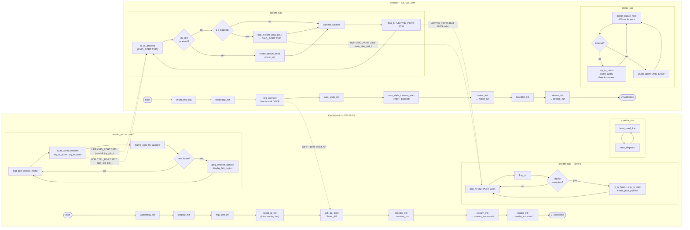

# Program Flow

Both nodes boot independently. The vehicle waits for a DHCP address from the dashboard before starting its tasks, so the dashboard should be powered first.

```mermaid
flowchart LR
    subgraph DASH["Dashboard — ESP32-S3"]
        direction TB

        DS([Boot])
        DS --> D0[watchdog_init]
        D0 --> D1[display_init]
        D1 --> D2[lvgl_port_init]
        D2 --> D3["scout_ui_init\n(intro loading bar)"]
        D3 --> D4["wifi_ap_start\nScout_AP"]
        D4 --> D5["monitor_init\n→ monitor_run"]
        D5 --> D6["stream_init\n→ stream_run  core 0"]
        D6 --> D7["render_init\n→ render_run  core 1"]
        D7 --> D8([vTaskDelete])

        subgraph STREAM_LOOP["stream_run — core 0"]
            direction TB
            SL1["udp_rx  VID_PORT 3334"] --> SL2[frag_rx]
            SL2 --> SL3{frame\ncomplete?}
            SL3 -- no --> SL1
            SL3 -- yes --> SL4["rc_tx_learn + cfg_tx_learn\nframe_pool_publish"]
            SL4 --> SL1
        end

        subgraph RENDER_LOOP["render_run — core 1"]
            direction TB
            RL1[lvgl_port_render_frame] --> RL2["rc_tx_send_throttled\ncfg_tx_push / cfg_tx_flush"]
            RL2 --> RL3[frame_pool_try_acquire]
            RL3 --> RL4{new frame?}
            RL4 -- no --> RL1
            RL4 -- yes --> RL5["jpeg_decode_rgb565\ndisplay_blit_region"]
            RL5 --> RL1
        end

        subgraph MONITOR_LOOP["monitor_run"]
            direction TB
            ML1[term_read_line] --> ML2[term_dispatch]
            ML2 --> ML1
        end
    end

    subgraph VEH["Vehicle — ESP32-CAM"]
        direction TB

        VS([Boot])
        VS --> V0[reset_info_log]
        V0 --> V1[watchdog_init]
        V1 --> V2["wifi_connect\nblocks until DHCP"]
        V2 --> V3[cam_state_init]
        V3 --> V4["cam_state_camera_start\n(retry + backoff)"]
        V4 --> V5["motor_init\n→ motor_run"]
        V5 --> V6[bme280_init]
        V6 --> V7["stream_init\n→ stream_run"]
        V7 --> V8([vTaskDelete])

        subgraph CAM_STREAM_LOOP["stream_run"]
            direction TB
            CL1[camera_capture] --> CL2["frag_tx  UDP VID_PORT 3334"]
            CL2 --> CL3["rc_rx_process\n(CMD_PORT 3335)"]
            CL3 --> CL4{joy_pkt\nreceived?}
            CL4 -- no --> CL5{1 s elapsed?}
            CL4 -- yes --> CL6["motor_queue_send\n(via rc_rx)"]
            CL5 -- no --> CL1
            CL5 -- yes --> CL7["udp_tx cam_diag_pkt_t\n→ DIAG_PORT 3336"]
            CL6 --> CL1
            CL7 --> CL1
        end

        subgraph MOTOR_LOOP["motor_run"]
            direction TB
            MR1["motor_queue_recv\n500 ms timeout"] --> MR2{timeout?}
            MR2 -- no --> MR3["joy_to_motor\nl298n_apply direction+speed"]
            MR2 -- yes --> MR4[l298n_apply CMD_STOP]
            MR3 --> MR1
            MR4 --> MR1
        end
    end

    V2 -. "WiFi — joins Scout_AP" .-> D4
    CL2 -. "UDP VID_PORT 3334  JPEG video" .-> SL1
    RL2 -. "UDP CMD_PORT 3335  joystick joy_pkt_t" .-> CL3
    CL7 -. "UDP DIAG_PORT 3336  cam_diag_pkt_t" .-> SL1
    RL2 -. "UDP CTRL_PORT 3337  cam_ctrl_pkt_t" .-> CL3
```
