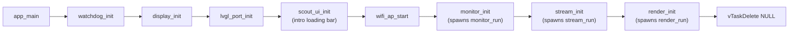
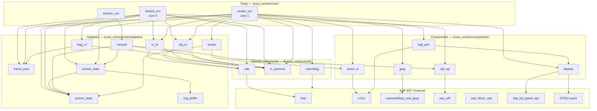

# Scout Screen — Architecture & Data Flow

## Startup sequence

`app_main` runs on the FreeRTOS main task. It initialises subsystems in order, spawns
the tasks, then deletes itself.

## Task overview

| Task | Core | Priority | Stack | Role |
|---|---|---|---|---|
| `monitor_run` | any | 2 | 3 072 B | UART diagnostic CLI — STATUS, STREAM (live), DIAG, CAMDIAG, HELP |
| `stream_run` | 0 | 5 | 4 096 B | UDP receive + fragment reassembly into ping-pong PSRAM buffers; receives `cam_diag_pkt_t` on `DIAG_PORT` inline |
| `render_run` | 1 | 4 | 8 192 B | Scene FSM + LVGL draw + JPEG decode + RC send |

---

## Full dependency graph

---

## Per-task dependencies

### `stream_run` — [stream.c](../scout_screen/main/stream.c)

Receives UDP packets on core 0 and reassembles them into complete JPEG frames for the
render task. Sets the active scene via `screen_state` each loop iteration. Learns the
camera IP from the first incoming packet and records it in `rc_tx` and `cfg_tx`. Also
receives `cam_diag_pkt_t` on `DIAG_PORT` inline and stores the packet in `screen_state`.

| Uses | File | Provides |
|---|---|---|
| `frag_rx` | [frag_rx.c](../scout_screen/main/adapters/frag_rx.c) | Packet header parsing, fragment-to-buffer copy, bitmask completion check |
| `frame_pool` | [frame_pool.c](../scout_screen/main/adapters/frame_pool.c) | `frame_pool_asm()`, `frame_pool_pkt()`, `frame_pool_publish(frame_len)` — ping-pong PSRAM buffer management |
| `screen_state` | [screen_state.c](../scout_screen/main/adapters/screen_state.c) | `screen_state_set_scene`, `screen_state_is_streaming`, `screen_state_has_streamed`, `screen_state_set_cam` |
| `screen_stats` | [screen_stats.c](../scout_screen/main/adapters/screen_stats.c) | `screen_stats_stream_tick_init`, `screen_stats_tick`, `screen_stats_tick_split` |
| `rc_tx` | [rc_tx.c](../scout_screen/main/adapters/rc_tx.c) | `rc_tx_bind(sock)`, `rc_tx_learn(&src)` — binds the outbound socket and records camera IP |
| `cfg_tx` | [cfg_tx.c](../scout_screen/main/adapters/cfg_tx.c) | `cfg_tx_bind(sock)`, `cfg_tx_learn(&src)` — binds outbound socket and records camera IP |
| `wifi_ap` | [wifi_ap.c](../scout_screen/components/wifi_ap/wifi_ap.c) | `wifi_ap_sta_count` — checks whether the cam is still on the AP |
| `udp` | [udp.c](../shared_components/udp/udp.c) | `udp_open`, `udp_set_rcvbuf`, `udp_set_recv_timeout`, `udp_rx` |
| `rc_protocol` | [rc_protocol.h](../shared_components/rc_protocol/rc_protocol.h) | `VID_PORT`, `DIAG_PORT`, `PKT_MAX`, `MAX_FRAGS`, `cam_diag_pkt_t` |

---

### `render_run` — [render.c](../scout_screen/main/render.c)

Drives the display on core 1 each tick: applies scene transitions, renders the LVGL frame,
reads the joystick and sends a `joy_pkt_t` to the camera via `rc_tx`, pushes any camera
config changes via `cfg_tx`, then decodes and blits any new camera frame into the display
framebuffer.

| Uses | File | Provides |
|---|---|---|
| `frame_pool` | [frame_pool.c](../scout_screen/main/adapters/frame_pool.c) | `frame_pool_try_acquire`, `frame_pool_release`, `frame_pool_set_render_task` |
| `screen_state` | [screen_state.c](../scout_screen/main/adapters/screen_state.c) | `screen_state_get_scene`, `screen_state_get_cam`, `screen_state_cam_dirty_take`, `screen_state_tick` |
| `screen_stats` | [screen_stats.c](../scout_screen/main/adapters/screen_stats.c) | `screen_stats_render_tick_init`, `screen_stats_tick`, `screen_stats_tick_split` |
| `scene` | [scene.c](../scout_screen/main/adapters/scene.c) | `scene_render()` — edge-detects scene changes and updates UI on core 1 |
| `rc_tx` | [rc_tx.c](../scout_screen/main/adapters/rc_tx.c) | `rc_tx_send_throttled(jx, jy)` — sends `joy_pkt_t` to camera |
| `cfg_tx` | [cfg_tx.c](../scout_screen/main/adapters/cfg_tx.c) | `cfg_tx_push(cmd, value)`, `cfg_tx_flush()` — sends `cam_ctrl_pkt_t` on config change |
| `lvgl_port` | [lvgl_port.c](../scout_screen/components/lvgl_port/lvgl_port.c) | `lvgl_port_render_frame`, `lvgl_port_set_video_region`, `lvgl_port_video_lock` |
| `scout_ui` | [scout_ui.c](../scout_screen/components/ui/scout_ui.c) | `scout_ui_get_joy`, `scout_ui_update_telemetry`, `scout_ui_update`, `scout_ui_cfg_dirty_take` |
| `jpeg` | [jpeg.c](../scout_screen/components/jpeg/jpeg.c) | `jpeg_init_canvas`, `jpeg_canvas_get`, `jpeg_decode_rgb565` |
| `display` | [display.c](../scout_screen/components/display/display.c) | `display_blit_region` |
| `watchdog` | [watchdog.c](../shared_components/watchdog/watchdog.c) | `watchdog_register`, `watchdog_reset` |
| `rc_protocol` | [rc_protocol.h](../shared_components/rc_protocol/rc_protocol.h) | `CAM_W`, `CAM_H`, `SCREEN_W`, `SCREEN_H`, `cam_diag_pkt_t`, `cam_ctrl_pkt_t` |

---

### `monitor_run` — [monitor.c](../scout_screen/main/monitor.c)

UART CLI on any core. Delegates entirely to the `console` adapter, which owns both
UART I/O and command dispatch.

| Uses | File | Provides |
|---|---|---|
| `console` | [console.c](../scout_screen/main/adapters/console.c) | `term_init`, `term_run_handler(term_dispatch)` — I/O loop + STATUS/STREAM/DIAG/CAMDIAG/HELP dispatch |

---

## Adapter second-level dependencies

| Adapter | Type | Depends on | Why |
|---|---|---|---|
| `frag_rx` | adapter | `frame_pool`, `rc_protocol` | Writes into assembly buffer; needs protocol constants for header parsing |
| `frame_pool` | adapter | `rc_protocol`, FreeRTOS | Pure ping-pong PSRAM buffer management; mutex for producer/consumer swap; `frame_pool_set_render_task` notifies the render task on publish |
| `rc_tx` | adapter | `udp`, `rc_protocol`, FreeRTOS | Sends `joy_pkt_t` to CMD_PORT; mutex guards cross-core camera address access; throttle timer suppresses redundant sends |
| `cfg_tx` | adapter | `udp`, `rc_protocol`, FreeRTOS | Sends `cam_ctrl_pkt_t` to CTRL_PORT; learns camera address from stream; `cfg_tx_flush()` deduplicates pending commands |
| `screen_state` | hub adapter | FreeRTOS | Lock-free volatile scene store; `cam_diag_pkt_t` cache with dirty flag; liveness check (`screen_state_is_streaming`) |
| `screen_stats` | adapter | `ring_buffer`, `screen_state` | Per-task tick accumulator; ring_push on frame commit; exposes `last`/`avg` columns for render and stream stats |
| `scene` | adapter | `screen_state`, `scout_ui` | Owns the scene config table; single edge-detect on core 1; calls `scout_ui_overlay/update` on scene change |
| `console` | adapter | `screen_state`, `screen_stats`, `wifi_ap`, `rc_protocol`, `esp_driver_uart` | UART I/O (`term_` prefix) and full command dispatch (STATUS/STREAM/DIAG/CAMDIAG/HELP); single adapter owns both I/O and routing |
| `ring_buffer` | utility | — | Fixed-size circular float buffer; `ring_push`, `ring_avg`, `ring_snap` — no project knowledge |
| `jpeg` | wrapper | `espressif/esp_new_jpeg` | Thin wrapper over the hardware JPEG codec; manages decode canvas allocation |
| `udp` | wrapper | `lwip/sockets` | Thin BSD-socket wrappers |
| `display` | driver wrapper | `esp_lcd_panel_ops`, GT911, Waveshare RGB LCD | Hides panel init and framebuffer details behind a pixel API |
| `lvgl_port` | adapter | LVGL, `display` | Initialises LVGL; owns flush callback with video-region clip; reads touch input → joystick x/y |
| `scout_ui` | UI layer | LVGL | Builds and owns all LVGL widgets: topbar, joystick, telemetry panel, config sliders, overlay text, themes (SONAR/DESERT/NIGHT OPS), WiFi RSSI icon |
| `wifi_ap` | adapter | `esp_wifi`, `esp_netif`, `nvs_flash` | Starts the AP and reports connected station count |
