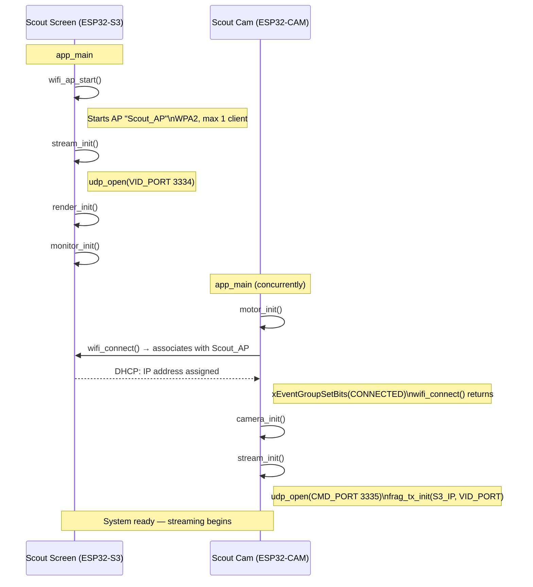
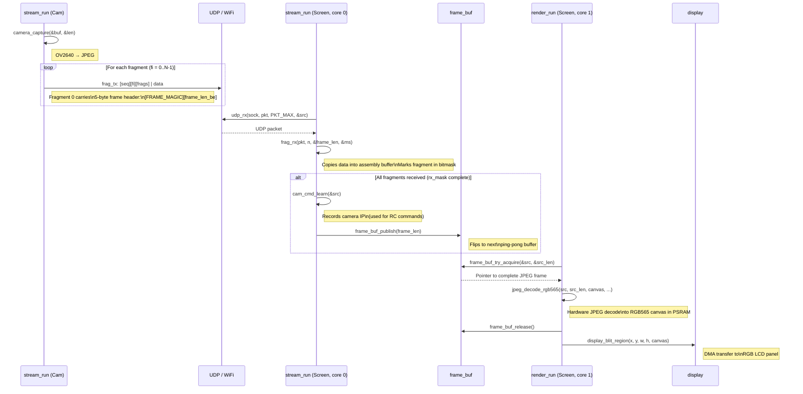
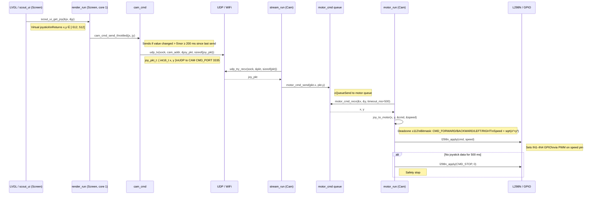

# Sequence Diagrams

Three core flows in the Scout system.

---

## 1. WiFi Startup

The screen starts a WiFi AP. The car connects as a STA client and blocks inside
`wifi_connect()` until an IP address has been assigned.

---

## 2. JPEG Frame Flow

The camera's `stream_run` captures JPEG frames and splits them into UDP packets.
The screen's `stream_run` reassembles the fragments and publishes complete frames
to the render task via ping-pong buffers.

---

## 3. Joystick → Motor

The render task reads the joystick position from LVGL and sends it as a UDP
packet to the camera's CMD port. The camera's `stream_run` receives the packet
and forwards the x/y coordinates to the motor task via a FreeRTOS queue.

