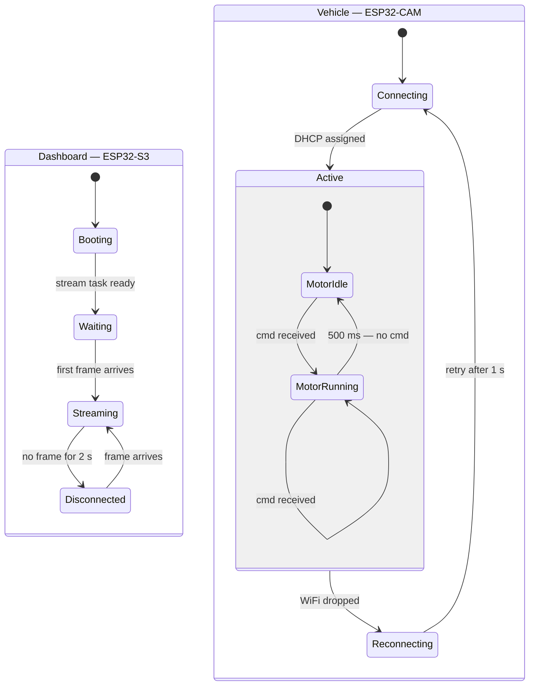

# State Diagram

The dashboard drives the visible system state through four scenes. The vehicle manages its own WiFi lifecycle independently, with a composite motor state inside the active connection.

