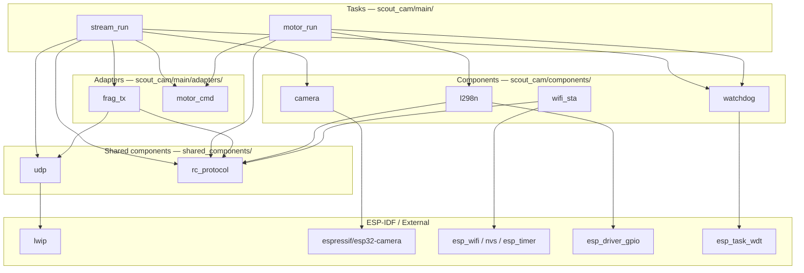

# Scout Cam — Architecture & Data Flow

## Startup sequence

`app_main` runs on the FreeRTOS main task. It initialises subsystems in order, spawns
the two tasks, then returns (FreeRTOS idle task takes over).

Note: cam has no UART monitor — RX/TX pins are reserved for I2C (future BME280 sensor).
Diagnostics will be sent over UDP and displayed by the screen (task 4).

## Task overview

| Task | Core | Priority | Stack | Role |
|---|---|---|---|---|
| `motor_run` | any | 6 | 2 048 B | Drains the motor command queue and applies each CMD byte to the L298N H-bridge |
| `stream_run` | any | 5 | 4 096 B | Camera capture → UDP fragment send; inbound CMD bytes → motor command queue |

---

## Full dependency graph

---

## Per-task dependencies

### `stream_run` — [stream.c](../scout_cam/main/stream.c)

Captures JPEG frames from the camera, fragments and sends them to the dashboard, and
drains inbound RC command bytes to forward to the motor task.

| Uses | File | Provides |
|---|---|---|
| `frag_tx` | [frag_tx.c](../scout_cam/main/adapters/frag_tx.c) | Splits a full JPEG frame into `PKT_MAX`-byte fragments with header; sends each via UDP |
| `camera` | [camera.c](../scout_cam/components/camera/camera.c) | `camera_capture(&buf, &len)`, `camera_release()` |
| `motor_cmd` | [motor_cmd.c](../scout_cam/main/adapters/motor_cmd.c) | `motor_cmd_send` — enqueues CMD bytes received from the dashboard |
| `watchdog` | [watchdog.c](../scout_cam/components/watchdog/watchdog.c) | `watchdog_register`, `watchdog_reset` |
| `udp` | [udp.c](../shared_components/udp/udp.c) | `udp_open`, `udp_addr`, `udp_set_send_timeout`, `udp_try_recv` |
| `rc_protocol` | [rc_protocol.h](../shared_components/rc_protocol/rc_protocol.h) | `S3_IP`, `VID_PORT`, `CMD_PORT`, `FRAME_MAX`, `PKT_MAX` |

---

### `motor_run` — [motor.c](../scout_cam/main/motor.c)

Blocks on the motor command queue and applies each received CMD byte to the L298N GPIO pins.
Stops the motors automatically if no command arrives within 500 ms.

| Uses | File | Provides |
|---|---|---|
| `l298n` | [l298n.c](../scout_cam/components/l298n/l298n.c) | `l298n_apply(cmd)` — sets IN1–IN4 GPIO to match CMD_* bitmask |
| `motor_cmd` | [motor_cmd.c](../scout_cam/main/adapters/motor_cmd.c) | `motor_cmd_recv` — blocks on the FreeRTOS command queue |
| `watchdog` | [watchdog.c](../scout_cam/components/watchdog/watchdog.c) | `watchdog_register`, `watchdog_reset` |
| `rc_protocol` | [rc_protocol.h](../shared_components/rc_protocol/rc_protocol.h) | `CMD_STOP`, `CMD_*` bitmasks |

---

## Adapter and component dependencies

| Module | Location | Type | Depends on | Why |
|---|---|---|---|---|
| `frag_tx` | `main/adapters/` | adapter | `udp`, `rc_protocol` | Writes the fragment header (`FRAME_MAGIC + frame_len` on fragment 0); slices payload into `PKT_MAX` chunks |
| `motor_cmd` | `main/adapters/` | adapter | FreeRTOS | Owns the command queue between `stream_run` (producer) and `motor_run` (consumer) |
| `camera` | `components/` | driver wrapper | `espressif/esp32-camera` | Wraps `esp_camera_fb_get/return`; hides `camera_fb_t` from task code |
| `l298n` | `components/l298n/` | GPIO driver | `esp_driver_gpio`, `rc_protocol` | Owns the L298N IN1–IN4 GPIO pins; interprets CMD_* bitmasks |
| `wifi_sta` | `components/` | adapter | `esp_wifi`, `esp_netif`, `nvs_flash`, `esp_timer`, `rc_protocol` | Connects to the Scout AP; 1 s timer-based retry on disconnect; blocks until IP assigned |
| `watchdog` | `components/watchdog/` | wrapper | `esp_task_wdt` | Thin wrapper so task files never include `esp_task_wdt.h` directly |
| `udp` | `shared_components/` | wrapper | `lwip/sockets` | Thin BSD-socket wrappers (`udp_open`, `udp_tx`, `udp_try_recv`) |
| `rc_protocol` | `shared_components/` | protocol header | — | All shared constants: AP credentials, IPs, ports, CMD_* bytes, `FRAME_MAX`, `PKT_MAX`, `CAM_W`, `CAM_H` |
