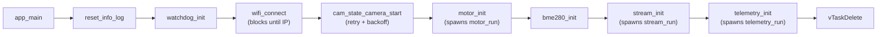
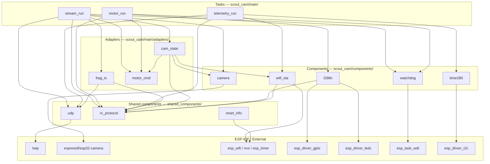

# Scout Cam — Architecture & Data Flow

## Startup sequence

`app_main` runs on the FreeRTOS main task. It initialises subsystems in order, spawns
the tasks, then deletes itself.

```mermaid
flowchart LR
    A[app_main] --> B[reset_info_log]
    B --> C[watchdog_init]
    C --> D["wifi_connect\n(blocks until IP)"]
    D --> E["cam_state_camera_start\n(retry + backoff)"]
    E --> F["motor_init\n(spawns motor_run)"]
    F --> G[bme280_init]
    G --> H["stream_init\n(spawns stream_run)"]
    H --> I["telemetry_init\n(spawns telemetry_run)"]
    I --> J[vTaskDelete]
```

## Task overview

| Task | Core | Priority | Stack | Role |
|---|---|---|---|---|
| `motor_run` | any | 6 | 2 048 B | Drains the motor command queue and applies each joy_pkt_t to the L298N H-bridge via PWM |
| `stream_run` | any | 5 | 4 096 B | Camera capture → UDP fragment send; inbound joy_pkt_t → motor command queue |
| `telemetry_run` | any | 3 | 3 072 B | Reads BME280, RSSI, heap, uptime and sends cam_diag_pkt_t to the screen periodically |

---

## Full dependency graph

```mermaid
graph TD
    subgraph tasks["Tasks — scout_cam/main/"]
        SR["stream_run"]
        MR["motor_run"]
        TR["telemetry_run"]
    end

    subgraph adapters["Adapters — scout_cam/main/adapters/"]
        FT[frag_tx]
        MQ[motor_cmd]
        CS[cam_state]
    end

    subgraph components["Components — scout_cam/components/"]
        CAM[camera]
        L298[l298n]
        WS[wifi_sta]
        WD[watchdog]
        BME[bme280]
    end

    subgraph shared["Shared components — shared_components/"]
        UDP[udp]
        RCP[rc_protocol]
        RI[reset_info]
    end

    subgraph sdk["ESP-IDF / External"]
        LWIP[lwip]
        ESP_CAM[espressif/esp32-camera]
        WIFI[esp_wifi / nvs / esp_timer]
        GPIO[esp_driver_gpio]
        LEDC[esp_driver_ledc]
        TWDT[esp_task_wdt]
        I2C[esp_driver_i2c]
    end

    SR --> FT & CAM & MQ & CS & WD & UDP & RCP
    MR --> L298 & MQ & WD & RCP
    TR --> BME & WS & UDP & RCP

    FT --> UDP & RCP
    CS --> CAM & MQ & WS & RCP
    CAM --> ESP_CAM
    L298 --> GPIO & LEDC & RCP
    WS --> WIFI & RCP
    WD --> TWDT
    UDP --> LWIP
    BME --> I2C
    RI --> WIFI
```

---

## Per-task dependencies

### `stream_run` — [stream.c](../scout_cam/main/stream.c)

Captures JPEG frames from the camera, fragments and sends them to the dashboard, and
drains inbound joy_pkt_t packets to forward to the motor task.

| Uses | File | Provides |
|---|---|---|
| `cam_state` | [cam_state.c](../scout_cam/main/adapters/cam_state.c) | `cam_state_try_resume` (reconnect), `cam_state_process_cmds` (drain inbound + streaming liveness) |
| `frag_tx` | [frag_tx.c](../scout_cam/main/adapters/frag_tx.c) | Splits a full JPEG frame into `PKT_MAX`-byte fragments with header; sends each via UDP |
| `camera` | [camera.c](../scout_cam/components/camera/camera.c) | `camera_capture(&buf, &len)`, `camera_release()` |
| `motor_cmd` | [motor_cmd.c](../scout_cam/main/adapters/motor_cmd.c) | `motor_cmd_send(jx, jy)` — enqueues joy values received from the dashboard |
| `watchdog` | [watchdog.c](../shared_components/watchdog/watchdog.c) | `watchdog_register`, `watchdog_reset` |
| `udp` | [udp.c](../shared_components/udp/udp.c) | `udp_open`, `udp_set_send_timeout`, `udp_try_recv` |
| `rc_protocol` | [rc_protocol.h](../shared_components/rc_protocol/rc_protocol.h) | `S3_IP`, `VID_PORT`, `CMD_PORT`, `FRAME_MAX`, `PKT_MAX` |

---

### `motor_run` — [motor.c](../scout_cam/main/motor.c)

Blocks on the motor command queue and converts each received `joy_pkt_t` (x/y, ‑255..255)
into a direction and PWM duty cycle applied to the L298N H-bridge.
Stops the motors automatically if no command arrives within 500 ms.

| Uses | File | Provides |
|---|---|---|
| `l298n` | [l298n.c](../scout_cam/components/l298n/l298n.c) | `l298n_apply(direction, speed)` — sets IN1–IN4 GPIO and LEDC PWM duty |
| `motor_cmd` | [motor_cmd.c](../scout_cam/main/adapters/motor_cmd.c) | `motor_cmd_recv(joy_pkt_t*)` — blocks on the FreeRTOS command queue |
| `watchdog` | [watchdog.c](../shared_components/watchdog/watchdog.c) | `watchdog_register`, `watchdog_reset` |
| `rc_protocol` | [rc_protocol.h](../shared_components/rc_protocol/rc_protocol.h) | `joy_pkt_t` struct |

---

### `telemetry_run` — [telemetry.c](../scout_cam/main/telemetry.c)

Reads sensor and system state every second and sends a `cam_diag_pkt_t` UDP packet to
the screen's `DIAG_PORT`.

| Uses | File | Provides |
|---|---|---|
| `bme280` | [bme280.c](../scout_cam/components/bme280/bme280.c) | `bme280_read(&temp, &hum, &pres)` |
| `wifi_sta` | [wifi_sta.c](../scout_cam/components/wifi_sta/wifi_sta.c) | `wifi_sta_get_rssi()` |
| `udp` | [udp.c](../shared_components/udp/udp.c) | `udp_open`, `udp_tx` |
| `rc_protocol` | [rc_protocol.h](../shared_components/rc_protocol/rc_protocol.h) | `cam_diag_pkt_t` struct, `DIAG_PORT`, `S3_IP` |

---

## Adapter and component dependencies

| Module | Location | Type | Depends on | Why |
|---|---|---|---|---|
| `cam_state` | `main/adapters/` | adapter | `camera`, `motor_cmd`, `wifi_sta`, `rc_protocol` | Owns camera init retry/backoff; owns reconnect and stream-pause logic; exposes `cam_status_t extern` |
| `frag_tx` | `main/adapters/` | adapter | `udp`, `rc_protocol` | Writes the fragment header (`FRAME_MAGIC + frame_len` on fragment 0); slices payload into `PKT_MAX` chunks |
| `motor_cmd` | `main/adapters/` | adapter | FreeRTOS | Owns the command queue between `stream_run` (producer) and `motor_run` (consumer) |
| `camera` | `components/` | driver wrapper | `espressif/esp32-camera` | Wraps `esp_camera_fb_get/return`; applies OV2640 sensor-windowing for 480×480 crop; hides camera headers |
| `l298n` | `components/l298n/` | GPIO + PWM driver | `esp_driver_gpio`, `esp_driver_ledc`, `rc_protocol` | Owns L298N IN1–IN4 GPIO pins and LEDC PWM channel; `l298n_apply(direction, speed)` sets duty before direction pins |
| `bme280` | `components/bme280/` | I²C driver | `esp_driver_i2c` | Handwritten Bosch driver; forced-mode with float compensation; SDA=GPIO2, SCL=GPIO3, addr=0x77 |
| `wifi_sta` | `components/` | adapter | `esp_wifi`, `esp_netif`, `nvs_flash`, `esp_timer`, `rc_protocol` | Connects to the Scout AP; 1 s timer-based retry on disconnect; blocks `wifi_connect()` until IP assigned |
| `watchdog` | `components/watchdog/` | wrapper | `esp_task_wdt` | Thin wrapper so task files never include `esp_task_wdt.h` directly |
| `reset_info` | `shared_components/` | utility | `esp_system` | Logs `esp_reset_reason()` at boot with a human-readable string |
| `udp` | `shared_components/` | wrapper | `lwip/sockets` | Thin BSD-socket wrappers (`udp_open`, `udp_tx`, `udp_try_recv`) |
| `rc_protocol` | `shared_components/` | protocol header | — | All shared constants: AP credentials, IPs, ports, CMD_* bytes, `FRAME_MAX`, `PKT_MAX`, `CAM_W`, `CAM_H`; `joy_pkt_t`; `cam_diag_pkt_t` |
