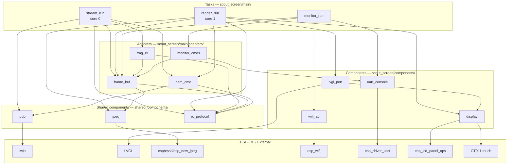

# Scout Screen — Architecture & Data Flow

## Startup sequence

`app_main` runs on the FreeRTOS main task. It initialises subsystems in order, spawns
the three tasks, then deletes itself.

## Task overview

| Task | Core | Priority | Stack | Role |
|---|---|---|---|---|
| `monitor_run` | any | 2 | 3 072 B | UART diagnostic CLI |
| `stream_run` | 0 | 5 | 4 096 B | UDP receive + fragment reassembly |
| `render_run` | 1 | 4 | 8 192 B | LVGL draw + JPEG decode + RC send |

---

## Full dependency graph

---

## Per-task dependencies

### `stream_run` — [stream.c](../scout_screen/main/stream.c)

Receives UDP packets on core 0 and reassembles them into complete JPEG frames for the render task.

| Uses | File | Provides |
|---|---|---|
| `frag_rx` | [frag_rx.c](../scout_screen/main/adapters/frag_rx.c) | Packet header parsing, fragment-to-buffer copy, bitmask completion check |
| `frame_buf` | [frame_buf.c](../scout_screen/main/adapters/frame_buf.c) | Assembly buffer pointer, ping-pong publish |
| `cam_cmd` | [cam_cmd.c](../scout_screen/main/adapters/cam_cmd.c) | Records camera IP from first packet, holds socket for RC send |
| `udp` | [udp.c](../shared_components/udp/udp.c) | `udp_open`, `udp_set_rcvbuf`, `udp_rx` |
| `rc_protocol` | [rc_protocol.h](../shared_components/rc_protocol/rc_protocol.h) | `VID_PORT`, `PKT_MAX` |

---

### `render_run` — [render.c](../scout_screen/main/render.c)

Drives the display on core 1: LVGL tick, JPEG decode, framebuffer blit, RC command send.

| Uses | File | Provides |
|---|---|---|
| `frame_buf` | [frame_buf.c](../scout_screen/main/adapters/frame_buf.c) | `frame_buf_try_decode`, `frame_buf_is_connected` |
| `cam_cmd` | [cam_cmd.c](../scout_screen/main/adapters/cam_cmd.c) | `cam_cmd_send` — 1-byte RC command to camera |
| `jpeg` | [jpeg.c](../shared_components/jpeg/jpeg.c) | `jpeg_init_canvas`, `jpeg_canvas_get` |
| `display` | [display.c](../scout_screen/components/display/display.c) | `display_blit_region`, `display_clear_region` |
| `lvgl_port` | [lvgl_port.c](../scout_screen/components/lvgl_port/lvgl_port.c) | `lvgl_port_render_frame`, `lvgl_port_get_cmd`, `lvgl_port_ui_update` |
| `rc_protocol` | [rc_protocol.h](../shared_components/rc_protocol/rc_protocol.h) | `CMD_STOP`, `CMD_*` bitmasks, `CAM_W`, `CAM_H` |

---

### `monitor_run` — [monitor.c](../scout_screen/main/monitor.c)

UART CLI on any core. Reads lines from UART0 and dispatches diagnostic commands.

| Uses | File | Provides |
|---|---|---|
| `frame_buf` | [frame_buf.c](../scout_screen/main/adapters/frame_buf.c) | `frame_buf_is_connected`, `frame_buf_get_stats` |
| `uart_console` | [uart_console.c](../scout_screen/components/uart_console/uart_console.c) | `uart_console_read_line`, `uart_console_println` |
| `wifi_ap` | [wifi_ap.c](../scout_screen/components/wifi_ap/wifi_ap.c) | `wifi_ap_sta_count` |
| `monitor_cmds` | [monitor_cmds.c](../scout_screen/main/adapters/monitor_cmds.c) | `monitor_dispatch` — routes STATUS / STREAM / DIAG / HELP |

---

## Adapter second-level dependencies

| Adapter | Type | Depends on | Why |
|---|---|---|---|
| `frag_rx` | adapter | `frame_buf`, `rc_protocol`, `lwip` | Writes into assembly buffer; needs protocol constants and `ntohs`/`ntohl` |
| `frame_buf` | adapter | `jpeg`, `rc_protocol`, FreeRTOS | Calls `jpeg_decode_rgb565`; needs `FRAME_MAX`/`PKT_MAX`; mutex for ping-pong; maintains rolling-average ring buffers (`stream_stats_t`) for transfer time, decode time, frame size, and FPS |
| `cam_cmd` | adapter | `udp`, `rc_protocol`, FreeRTOS | Calls `udp_tx`; needs `CMD_PORT`; mutex guards cross-core address access |
| `monitor_cmds` | adapter | `frame_buf`, `uart_console` | Reads `stream_stats_t` from frame_buf; prints via uart_console |
| `uart_console` | wrapper | `esp_driver_uart` | Wraps UART driver for line-mode input/output |
| `wifi_ap` | adapter | `esp_wifi`, `esp_netif`, `nvs_flash` | Starts the AP and reports connected station count |
| `jpeg` | wrapper | `espressif/esp_new_jpeg` | Thin wrapper over the hardware JPEG codec |
| `udp` | wrapper | `lwip/sockets` | Thin BSD-socket wrappers |
| `display` | driver wrapper | `esp_lcd_panel_ops`, GT911, waveshare RGB LCD | Hides panel init and framebuffer details behind a pixel API |
| `lvgl_port` | adapter | LVGL, `display`, `rc_protocol` | Initialises LVGL, owns joystick `CMD_*` state, flush callback calls `display_draw_bitmap` |
