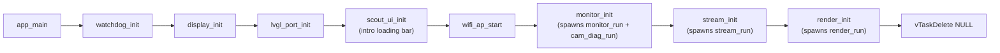
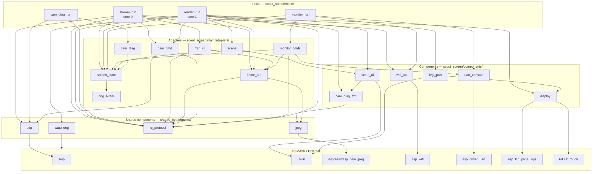

# Scout Screen — Architecture & Data Flow

## Startup sequence

`app_main` runs on the FreeRTOS main task. It initialises subsystems in order, spawns
the tasks, then deletes itself.

```mermaid
flowchart LR
    A[app_main] --> B[watchdog_init]
    B --> C[display_init]
    C --> D[lvgl_port_init]
    D --> E["scout_ui_init\n(intro loading bar)"]
    E --> F[wifi_ap_start]
    F --> G["monitor_init\n(spawns monitor_run + cam_diag_run)"]
    G --> H["stream_init\n(spawns stream_run)"]
    H --> I["render_init\n(spawns render_run)"]
    I --> J[vTaskDelete NULL]
```

> **Design note:** `monitor_init` currently spawns `cam_diag_run` as a side-effect.
> `cam_diag` is a UDP receiver task (not a diagnostic CLI helper) and logically belongs
> alongside `stream_init`/`render_init` in `main.c`. Tracked in TASKS.md §7.

## Task overview

| Task | Core | Priority | Stack | Role |
|---|---|---|---|---|
| `monitor_run` | any | 2 | 3 072 B | UART diagnostic CLI — STATUS, STREAM (live), DIAG, HELP |
| `cam_diag_run` | any | 3 | 2 048 B | Receives `cam_diag_pkt_t` on DIAG_PORT and stores it in `screen_state` |
| `stream_run` | 0 | 5 | 4 096 B | UDP receive + fragment reassembly into ping-pong PSRAM buffers |
| `render_run` | 1 | 4 | 8 192 B | Scene FSM + LVGL draw + JPEG decode + RC send |

---

## Full dependency graph

```mermaid
graph TD
    subgraph tasks["Tasks — scout_screen/main/"]
        SR["stream_run\ncore 0"]
        RR["render_run\ncore 1"]
        MR["monitor_run"]
        CD["cam_diag_run"]
    end

    subgraph adapters["Adapters — scout_screen/main/adapters/"]
        FB[frame_buf]
        CC[cam_cmd]
        FR[frag_rx]
        MC[monitor_cmds]
        SS[screen_state]
        SC[scene]
        RB[ring_buffer]
        CDIAG[cam_diag]
    end

    subgraph shared["Shared components — shared_components/"]
        JP[jpeg]
        UDP[udp]
        RCP[rc_protocol]
        WD[watchdog]
    end

    subgraph components["Components — scout_screen/components/"]
        DISP[display]
        UI[lvgl_port]
        SUI[scout_ui]
        UC[uart_console]
        WA[wifi_ap]
        CDF[cam_diag_fmt]
    end

    subgraph sdk["ESP-IDF / External"]
        LWIP[lwip]
        LVGL[LVGL]
        JPEG_LIB[espressif/esp_new_jpeg]
        WIFI[esp_wifi]
        UART_DRV[esp_driver_uart]
        LCD[esp_lcd_panel_ops]
        GT[GT911 touch]
    end

    SR --> FR & FB & SS & CC & UDP & RCP & WA
    RR --> FB & SS & SC & CC & JP & DISP & UI & SUI & CDF & WD & RCP
    MR --> SS & UC & WA & MC
    CD --> CDIAG & UDP & RCP

    FR --> FB & RCP
    FB --> JP & RCP
    CC --> UDP & RCP
    MC --> FB & SS & UC & RCP
    SC --> SS & SUI
    SS --> RB
    CDIAG --> SS

    CDF --> RCP
    SUI --> LVGL & CDF
    JP --> JPEG_LIB
    UDP --> LWIP
    UI --> LVGL & DISP
    DISP --> LCD & GT
    WA --> WIFI
    UC --> UART_DRV
    WD --> sdk
```

---

## Per-task dependencies

### `stream_run` — [stream.c](../scout_screen/main/stream.c)

Receives UDP packets on core 0 and reassembles them into complete JPEG frames for the render task.
Sets the active scene via `screen_state` each loop iteration. Learns the camera IP from the first
incoming packet and records it via `cam_cmd`.

| Uses | File | Provides |
|---|---|---|
| `frag_rx` | [frag_rx.c](../scout_screen/main/adapters/frag_rx.c) | Packet header parsing, fragment-to-buffer copy, bitmask completion check |
| `frame_buf` | [frame_buf.c](../scout_screen/main/adapters/frame_buf.c) | Assembly buffer pointer, ping-pong publish |
| `screen_state` | [screen_state.c](../scout_screen/main/adapters/screen_state.c) | `screen_state_set_scene`, `screen_state_is_streaming`, `screen_state_has_streamed`, `screen_state_tick` |
| `cam_cmd` | [cam_cmd.c](../scout_screen/main/adapters/cam_cmd.c) | `cam_cmd_learn(&src)` — records camera IP from incoming packet source |
| `wifi_ap` | [wifi_ap.c](../scout_screen/components/wifi_ap/wifi_ap.c) | `wifi_ap_sta_count` — checks whether the cam is still on the AP |
| `udp` | [udp.c](../shared_components/udp/udp.c) | `udp_open`, `udp_set_rcvbuf`, `udp_set_recv_timeout`, `udp_rx` |
| `rc_protocol` | [rc_protocol.h](../shared_components/rc_protocol/rc_protocol.h) | `VID_PORT`, `PKT_MAX`, `MAX_FRAGS` |

---

### `render_run` — [render.c](../scout_screen/main/render.c)

Drives the display on core 1 each tick: applies scene transitions, renders the LVGL frame,
reads the joystick and sends a `joy_pkt_t` to the camera, then decodes and blits any new
camera frame into the display framebuffer.

| Uses | File | Provides |
|---|---|---|
| `frame_buf` | [frame_buf.c](../scout_screen/main/adapters/frame_buf.c) | `frame_buf_try_acquire`, `frame_buf_release` |
| `screen_state` | [screen_state.c](../scout_screen/main/adapters/screen_state.c) | `screen_state_get_scene`, `screen_state_get_cam`, `screen_state_cam_dirty_take`, `screen_state_tick` |
| `scene` | [scene.c](../scout_screen/main/adapters/scene.c) | `scene_render()` — edge-detects scene changes and updates UI on core 1 |
| `cam_cmd` | [cam_cmd.c](../scout_screen/main/adapters/cam_cmd.c) | `cam_cmd_send_throttled(jx, jy)` — sends `joy_pkt_t` to camera |
| `lvgl_port` | [lvgl_port.c](../scout_screen/components/lvgl_port/lvgl_port.c) | `lvgl_port_render_frame`, `lvgl_port_set_video_region`, `lvgl_port_video_lock` |
| `scout_ui` | [scout_ui.c](../scout_screen/components/ui/scout_ui.c) | `scout_ui_get_joy`, `scout_ui_update_telemetry`, `scout_ui_update` |
| `jpeg` | [jpeg.c](../shared_components/jpeg/jpeg.c) | `jpeg_init_canvas`, `jpeg_canvas_get`, `jpeg_decode_rgb565` |
| `display` | [display.c](../scout_screen/components/display/display.c) | `display_blit_region` |
| `watchdog` | [watchdog.c](../shared_components/watchdog/watchdog.c) | `watchdog_register`, `watchdog_reset` |
| `rc_protocol` | [rc_protocol.h](../shared_components/rc_protocol/rc_protocol.h) | `CAM_W`, `CAM_H`, `SCREEN_W`, `SCREEN_H`, `cam_diag_pkt_t` |

---

### `monitor_run` — [monitor.c](../scout_screen/main/monitor.c)

UART CLI on any core. Reads lines from UART0 and dispatches diagnostic commands.

| Uses | File | Provides |
|---|---|---|
| `screen_state` | [screen_state.c](../scout_screen/main/adapters/screen_state.c) | `screen_state_is_streaming`, `screen_state_get_scene`, `screen_state_scene_name` |
| `monitor_cmds` | [monitor_cmds.c](../scout_screen/main/adapters/monitor_cmds.c) | `monitor_dispatch` — routes STATUS / STREAM (live, ANSI) / DIAG / HELP |
| `uart_console` | [uart_console.c](../scout_screen/components/uart_console/uart_console.c) | `uart_console_read_line`, `uart_console_println`, `uart_console_try_getchar` |
| `wifi_ap` | [wifi_ap.c](../scout_screen/components/wifi_ap/wifi_ap.c) | `wifi_ap_sta_count` |

---

### `cam_diag_run` — [cam_diag.c](../scout_screen/main/adapters/cam_diag.c)

UDP receive task that listens on `DIAG_PORT`. On each received `cam_diag_pkt_t`, stores the
packet in `screen_state` so `render_run` and `monitor_run` can read it.

> Spawned by `monitor_init` — logically belongs in `main.c` alongside the other task inits.

| Uses | File | Provides |
|---|---|---|
| `screen_state` | [screen_state.c](../scout_screen/main/adapters/screen_state.c) | `screen_state_set_cam` |
| `udp` | [udp.c](../shared_components/udp/udp.c) | `udp_open`, `udp_rx` |
| `rc_protocol` | [rc_protocol.h](../shared_components/rc_protocol/rc_protocol.h) | `DIAG_PORT`, `cam_diag_pkt_t` |

---

## Adapter second-level dependencies

| Adapter | Type | Depends on | Why |
|---|---|---|---|
| `frag_rx` | adapter | `frame_buf`, `rc_protocol` | Writes into assembly buffer; needs protocol constants for header parsing |
| `frame_buf` | adapter | `jpeg`, `rc_protocol`, FreeRTOS | Pure ping-pong PSRAM buffer management; calls `jpeg_decode_rgb565` on publish; mutex for producer/consumer swap |
| `cam_cmd` | adapter | `udp`, `rc_protocol`, FreeRTOS | Sends `joy_pkt_t` via `udp_tx` to `CMD_PORT`; mutex guards cross-core camera address access; throttle timer suppresses redundant sends |
| `screen_state` | hub adapter | `ring_buffer`, FreeRTOS | Lock-free volatile scene store; `cam_diag_pkt_t` cache with dirty flag; tick/ring-buffer commit hub for render and stream stats |
| `scene` | adapter | `screen_state`, `scout_ui` | Owns the scene config table; single edge-detect on core 1; calls `scout_ui_overlay/update` on scene change |
| `ring_buffer` | utility | — | Fixed-size circular float buffer; `ring_push`, `ring_avg`, `ring_snap` — no project knowledge |
| `cam_diag` | adapter | `screen_state`, `udp`, `rc_protocol` | Background UDP receiver; writes received diagnostic packets into `screen_state` |
| `monitor_cmds` | adapter | `frame_buf`, `screen_state`, `uart_console` | Routes STATUS/STREAM/DIAG/HELP; live STREAM mode redraws in-place via ANSI cursor escape every 500 ms |
| `uart_console` | wrapper | `esp_driver_uart` | Wraps UART driver for line-mode input/output; `uart_console_try_getchar` for non-blocking read |
| `wifi_ap` | adapter | `esp_wifi`, `esp_netif`, `nvs_flash` | Starts the AP and reports connected station count |
| `cam_diag_fmt` | utility | `rc_protocol` | Shared format functions (`cam_diag_fmt_temp/humi/pres`) used by both `scout_ui` and `monitor_cmds` |
| `jpeg` | wrapper | `espressif/esp_new_jpeg` | Thin wrapper over the hardware JPEG codec; manages decode canvas allocation |
| `udp` | wrapper | `lwip/sockets` | Thin BSD-socket wrappers |
| `display` | driver wrapper | `esp_lcd_panel_ops`, GT911, Waveshare RGB LCD | Hides panel init and framebuffer details behind a pixel API |
| `lvgl_port` | adapter | LVGL, `display` | Initialises LVGL; owns flush callback with video-region clip; reads touch input → joystick x/y |
| `scout_ui` | UI layer | LVGL, `cam_diag_fmt` | Builds and owns all LVGL widgets: topbar, joystick, telemetry panel, overlay text, themes (SONAR/DESERT/NIGHT OPS), WiFi RSSI icon |
